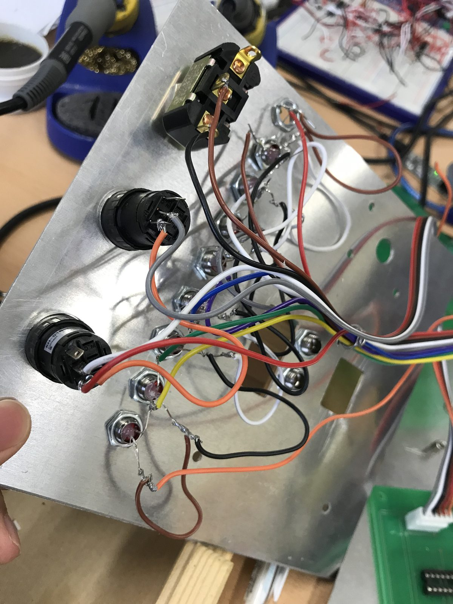

# 제54회 전국기능경기대회 — 공업전자기기 (장려상)

2019년 제54회 전국기능경기대회 공업전자기기 직종에서 4개 과제를 모두 수행했습니다. 실제 결과물 파일이 있는 건 1과제(PCB 설계)와 3과제(임베디드 프로그래밍, [`elevator-control-system`](../elevator-control-system) 참고)이고, 2·4과제는 무엇을 했는지 문서로 정리했습니다.

## 1과제 — 하드웨어 설계 ("납 연기 제거기") (PCB 설계, 5시간30분)

- **과제명**: 하드웨어설계 (납 연기 제거기 구현) · **제한시간**: 5시간 30분 (회로설계 1시간 + PCB설계 2시간30분 + 조립·동작 2시간)
- **동작 요구사항**: 전원 스위치를 누르면 팬모터가 동작하고, 1~3단 스위치에 따라 팬 회전 속도(약풍/중풍/강풍)가 바뀝니다. 가변저항으로 LED 바그래프 점등 개수와 발진 주파수 등을 조절합니다.
- **회로설계(Design A/B/C)**: LM339 비교기 기반 LED 바그래프(Design A), 4071/4175 기반 시퀀스 회로(Design B), 4001 기반 약 430kHz 발진회로(Design C)를 설계하고 시뮬레이션으로 검증.
- **PCB 설계**: 검증된 메인 회로를 1-Layer(단면) PCB로 직접 배치·배선 — 부품은 TOP면, 배선은 BOTTOM면, 보드 크기 160×100mm, 비아/자동배선 금지, 배선 최소 폭 0.3mm 등 세부 규격을 지켜 설계. 완성 후 Gerber(Top/Bottom Layer, KeepOut/외곽선)와 NC Drill 파일을 제작용으로 제출.
- **조립**: 설계한 메인 보드와, 만능기판에 별도로 조립한 FRONT(패널) 보드를 결합해 실제 동작을 시연.

(제한시간 내 PCB 설계를 마치지 못한 선수를 위한 백업용 완제 기판이 지급되기도 하지만, 이 폴더의 결과물은 직접 설계를 완료해 제작·조립까지 진행한 것입니다.)

## 포함된 파일

`task1-lead-smoke-remover/pcb1/`
- `gerber/` — 원본 Gerber 파일 (프로젝트명 "lead smoke remover" 그대로 보존)
- `nc-drill/` — NC Drill 파일
- `render/` — 레이어별 렌더링 이미지

| 파일 | 내용 |
|---|---|
| `01-top-copper.png` | 상단 동박(배선) — 이 보드는 부품 패드 위주이고 실제 배선은 대부분 하단에 있습니다 |
| `02-bottom-copper.png` | 하단 동박(배선) |
| `03-top-silkscreen.png` | 상단 실크스크린 |
| `04-bottom-silkscreen.png` | 하단 실크스크린 |
| `05-top-soldermask.png` | 상단 솔더마스크 |
| `06-bottom-soldermask.png` | 하단 솔더마스크 |
| `07-board-outline.png` | 보드 외곽선 |

**FRONT 패널 배선 작업 사진**: 재료 목록의 LED 스위치(전원/1단/2단/3단) 구성과 일치하는 실제 배선 작업 사진입니다.

## 2과제 — 고장수리 및 측정 (3bit Digital Phase Shifter, 2시간30분)

지급된 완제 PCB(운영측 제작)는 '3bit Digital Phase Shifter'의 동작을 모델링한 회로입니다. 주어진 도면과 다르게 잘못 배선되었거나, 부품 불량, 부품값이 바뀐 결함을 찾아 수리하는 과제입니다. 수리 전/후 시험점(TP)의 파형을 오실로스코프로 측정해 이미지로 저장하고, 고장 부분·증상을 정리한 한글 문서에 삽입해 PDF로 제출합니다. 보드 자체는 조직위 제작물이라 설계 파일은 없지만, 결함 진단·수리·측정·문서화는 직접 수행했습니다.

## 3과제 — Embedded system Programming (2대 엘리베이터 제어, 3시간)

이 과제의 C 코드는 [`elevator-control-system`](../elevator-control-system)에 있습니다. 과제 내용은 그 폴더의 README를 참고하세요.

## 4과제 — 어셈블리 (음료수 자판기, 3시간)

음료수 자판기를 모델링한 과제입니다. Main PCB, Display PCB, Front PCB, 알루미늄 판넬을 IDC/Plate Cable과 볼트·너트·PCB Support로 결합해 최종 조립합니다. 가변저항으로 발진 주파수(TP1=100Hz, TP2=10Hz)를 맞추고, 남은 컵 수를 FND에 표시하는 등 조립 후 동작 조정까지 포함됩니다. 기구 조립 작업이라 별도 설계 파일은 없습니다.

---

# 54th National Skills Competition — Industrial Electronics (Merit Award)

I competed in all 4 tasks at the 54th National round. Actual result files exist for Task 1 (PCB design) and Task 3 (embedded programming, see [`elevator-control-system`](../elevator-control-system)); Tasks 2 and 4 are documented below.

## Task 1 — Hardware Design ("lead smoke remover") (PCB layout, 5h 30m)

- **Task**: Hardware Design, implementing a lead-smoke extractor fan unit · **Time limit**: 5h 30m (1h circuit design + 2h30m PCB design + 2h assembly/bring-up)
- **Behavior**: pressing the power switch starts the fan; a 3-position switch selects fan speed (low/medium/high); potentiometers adjust an LED bar-graph display and an oscillator frequency.
- **Circuit design (Design A/B/C)**: an LM339-comparator LED bar-graph (A), a 4071/4175-based sequence circuit (B), and a ~430kHz 4001-based oscillator (C) — each designed and verified by simulation.
- **PCB design**: laid out and routed the verified main circuit as a 1-layer PCB — components on top, routing on bottom, 160×100mm board, no vias or auto-routing, 0.3mm minimum trace width, and other spec constraints. Submitted Gerber (top/bottom layer, board outline) and NC Drill files for fabrication.
- **Assembly**: combined the designed main board with a separately hand-wired FRONT panel board (built on prototype board) to demonstrate the finished unit.

(A fallback pre-fabricated board is available for anyone who doesn't finish the layout in time, but what's here is a completed, self-designed layout that was also assembled.)

## Contents

`task1-lead-smoke-remover/pcb1/`
- `gerber/` — raw Gerber files (project name "lead smoke remover" preserved as-is)
- `nc-drill/` — NC drill file
- `render/` — per-layer rendered images (see table above)

**FRONT panel wiring photo**: matches the LED switch configuration (power/low/med/high) from the materials list.

## Task 2 — Fault-Finding & Measurement (3-bit Digital Phase Shifter, 2.5 hours)

The supplied pre-fabricated PCB (organizer-made) models a '3-bit Digital Phase Shifter'. Faults — wiring that doesn't match the given diagram, bad components, or changed component values — are deliberately planted and must be found and repaired. Before/after waveforms at test points are captured with an oscilloscope, inserted into a submitted write-up, and exported as PDF. The board isn't my design, but the fault diagnosis, repair, measurement, and documentation were.

## Task 3 — Embedded System Programming (dual-elevator control, 3 hours)

The C code for this task lives in [`elevator-control-system`](../elevator-control-system) — see that folder's README for the task details.

## Task 4 — Assembly (vending machine, 3 hours)

Models a beverage vending machine. Combine the Main, Display, and Front PCBs plus an aluminum panel using IDC/plate cable and bolts/nuts/standoffs, then tune the assembled unit (potentiometers set oscillator frequencies at TP1=100Hz and TP2=10Hz, a display shows remaining cup count, etc.). A hands-on assembly task with no design file to show.
