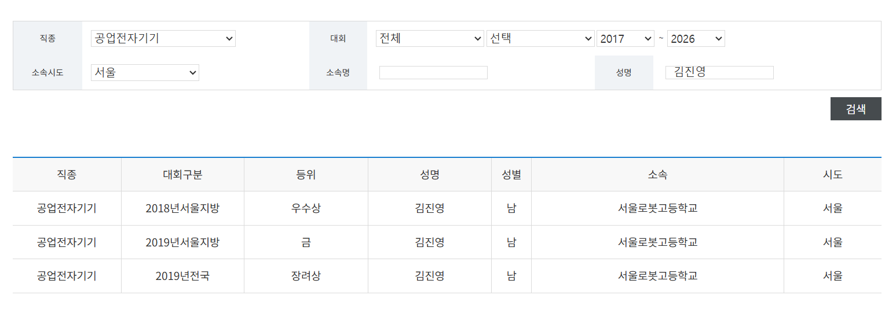

# Embedded Systems Practice — 기능경기대회 준비 자료

서울로봇고등학교 공업전자기기 기능반 활동 및 전국기능경기대회 준비 과정에서 작성한 임베디드 C 코드, 회로/PCB 설계 자료입니다.

**대회 결과**
- 2018년 서울시 지방기능경기대회 — 우수상
- 2019년 서울시 지방기능경기대회 — 금상
- 2019년 전국기능경기대회(제54회) — 장려상

> **공식 입상 확인**: 한국산업인력공단이 운영하는 마이스터넷(Meister Net) [입상자 조회](https://meister.hrdkorea.or.kr/sub/3/6/7/skillMatchTournament/prizeWinnerList.do)에서 직종 "공업전자기기", 소속시도 "서울", 성명 "김진영"으로 검색하면 아래 결과를 직접 확인할 수 있습니다.
>
> 

## 배경: 공업전자기기 종목이란

공업전자기기(Industrial Electronics)는 전국기능경기대회 직종 중 하나로, 산업 현장에서 쓰이는 전자 계측/제어 장비에 대한 이론과 회로 설계·PCB 설계·조립·고장수리 및 측정·임베디드 프로그래밍 능력을 겨루는 종목입니다. 매년 다른 문제가 출제되며, 지방대회에서 입상해야 전국대회에 진출할 수 있습니다.

경기는 보통 5개 내외의 세부 과제로 구성되고, 과제마다 성격이 다릅니다.

- **1과제(하드웨어설계/회로설계)** — 주어진 요구사항으로 로직 회로를 직접 설계·시뮬레이션하고, 그 회로를 바탕으로 인쇄회로기판(PCB) 레이아웃을 대회장에서 **직접, 처음부터** CAD로 설계해 Gerber/NC Drill 파일로 제출하는 과제입니다. (시간 내에 설계를 끝내지 못한 선수를 위한 백업용 완제 기판이 지급되기도 하지만, 정상적으로는 선수 본인이 설계합니다.)
- **2과제 이후(조립, 고장수리 및 측정, 프로그램 작성, 디스플레이 시스템 조립 등)** — 대부분 대회 운영측이 미리 제작한 기판(예: 회로에 고의로 결함을 심어둔 보드)을 지급받아 조립·수리·프로그래밍하는 과제입니다. **설계 파일(Gerber 등)이 실제로 제 것으로 남아있는 건 1과제뿐**이라 그것만 저장소에 파일로 올렸습니다 — 나머지 과제는 보드 자체가 대회 운영 자료이지만, 실제로 수행한 작업(조립·고장수리·프로그래밍 등) 내용은 각 대회 폴더 README에 상세히 문서로 정리했습니다.

## 대회별 과제 구성과 결과물 매칭

세 대회 모두 문제/정답/채점기준표 원문은 저작권이 있는 공식 자료라 포함하지 않았고, 아래는 각 과제가 어떤 작업이었는지와 이 저장소에 무엇이 있는지(혹은 왜 없는지)를 정리한 것입니다.

### 2018년도 서울시 지방기능경기대회 (5과제, 우수상)

| 과제 | 과제명 | 내용 | 이 저장소의 결과물 |
|---|---|---|---|
| 1과제 | 인쇄회로기판 설계 및 기구물설계 | 회로도를 보고 PCB 배치·배선 + 기구물(패널) CAD 설계를 대회장에서 직접 진행 | 📄 [문서화](./2018-regional-competition) (설계 파일은 남아있지 않음) |
| 2과제 | 하드웨어 설계 (신호등) | 만능기판에 신호등 동작 회로를 직접 납땜·배선 | 📄 [문서화](./2018-regional-competition) (PCB 없는 조립 과제) |
| 3과제 | 고장수리 및 측정 (IC체커기) | 지급된 완제 기판(Bare PCB 지급)에서 고의로 심어둔 결함을 찾아 수리 | 📄 [문서화](./2018-regional-competition) (기판은 운영측 제작) |
| 4과제 | 프로그램설계 (냉장고 시스템) | 지급된 Atmega128 완제 모듈+PCB에 C/ASM으로 냉장고 제어 프로그램 작성, 블루투스 앱 연동 | 📄 [문서화](./2018-regional-competition) (남은 소스는 배포용 예제뿐) |
| 5과제 | 어셈블리 | Main PCB + Front PCB를 볼트/너트/케이블로 최종 결합 조립 | 📄 [문서화](./2018-regional-competition) (설계 파일 없는 기구 조립) |

### 2019년도 서울시 지방기능경기대회 (4과제, 금상)

| 과제 | 과제명 | 내용 | 이 저장소의 결과물 |
|---|---|---|---|
| 1과제 | 하드웨어설계 | 로직회로(Design A/B) 설계·시뮬레이션 + 시간 반복 카운터 PCB를 직접 배치·배선 | ✅ [`task1-hardware-design`](./2019-regional-competition/task1-hardware-design) (Gerber+렌더) |
| 2과제 | 고장수리 및 측정 | 조도 경보기 PCB의 5개 고장점을 찾아 수리, 오실로스코프로 측정·제출 | 📄🖼️ [문서화+실제 답안지 사진](./2019-regional-competition) (기판은 운영측 제작) |
| 3과제 | 프로그램설계 (계산기) | 주어진 예제 프로그램을 참조·수정해 사칙연산 계산기 완성 | 📄 [문서화](./2019-regional-competition) (남은 소스는 예제뿐) |
| 4과제 | 어셈블러 | Main+Display+Front PCB 결합, 만능기판 가공·조립 | 📄 [문서화](./2019-regional-competition) (설계 파일 없는 조립) |

### 제54회 전국기능경기대회 (4과제, 장려상)

| 과제 | 과제명 | 내용 | 이 저장소의 결과물 |
|---|---|---|---|
| 1과제 | 하드웨어 설계 (납 연기 제거기) | 로직회로(Design A/B/C) 설계 + PCB 배치·배선(CAD, 2시간30분) + 조립 | ✅🖼️ [`task1-lead-smoke-remover`](./2019-national-competition/task1-lead-smoke-remover) (Gerber+렌더+FRONT 배선 사진) |
| 2과제 | 고장수리 및 측정 | 3bit Digital Phase Shifter PCB의 고장점을 수리, 오실로스코프로 측정 | 📄 [문서화](./2019-national-competition) (기판은 운영측 제작) |
| 3과제 | Embedded system Programming | 2대 엘리베이터 제어 시스템 C 코드 작성 (UART, 센서, LCD/OLED 표시) | ✅ [`elevator-control-system`](./elevator-control-system) (소스 코드) |
| 4과제 | 어셈블리 (음료수 자판기) | Main+Display+Front PCB+판넬 결합 조립 | 📄 [문서화](./2019-national-competition) (설계 파일 없는 조립) |

✅ = 이 저장소에 실제 설계/코드 파일이 있음, 📄 = 파일은 없지만 요구사항·구성·직접 수행한 작업을 README에 상세히 정리함, 🖼️ = 실제 촬영한 사진이 있음 (원본 문제/정답/채점기준표 등 저작권 있는 공식 문서는 포함하지 않음).

## 프로젝트 구성

**대회별 폴더 (1과제 PCB 설계 파일 + 전체 과제 문서화)**
- [`2018-regional-competition`](./2018-regional-competition) — 2018년 서울시 지방기능경기대회, 5과제 전체 문서화 (우수상, 설계 파일 없음)
- [`2019-regional-competition`](./2019-regional-competition) — 2019년 서울시 지방기능경기대회, 1과제 PCB 설계 + 4과제 전체 문서화 (금상)
- [`2019-national-competition`](./2019-national-competition) — 제54회 전국기능경기대회, 1과제 PCB 설계 "납 연기 제거기" + 4과제 전체 문서화 (장려상)

**임베디드 C 코드**
- [`elevator-control-system`](./elevator-control-system) — ATmega128 기반 2대 엘리베이터 제어 시뮬레이션. UART 통신, 층 이동 로직, 센서/부저/LED 표시 구현
- [`motor-pwm-control`](./motor-pwm-control) — ATmega128 기반 PWM 모터 속도 제어 + 7세그먼트 디스플레이 (인터럽트 기반 실시간 제어)

**회로설계 연습**
- [`circuit-design-practice-log`](./circuit-design-practice-log) — 2019.08.15~10.04, 약 7주간 매일 진행한 OrCAD 회로설계/PCB 레이아웃 연습 기록 (39개 세션)
- [`circuit-design-problem-set`](./circuit-design-problem-set) — 회로설계(1과제) 연습 문제·정답 7종

**실습/현장 사진**
- [`photos`](./photos) — 답안지, 배선 작업, 오실로스코프 측정 화면 등 실제 촬영 사진

모두 기능경기대회 준비 과정에서 작성한 실습/연습 자료이며, 상용 제품이 아닙니다. 대회 공식 문제지·정답지·채점기준표 등 저작권이 있는 원문 자료는 포함하지 않았고, 문제 내용은 이해를 돕기 위해 요약해 설명했습니다.

---

# Embedded Systems Practice — Korean National Skills Competition Prep

Embedded C code and circuit/PCB design work from my time on the Industrial Electronics skills team at Seoul Robot High School, preparing for South Korea's National Skills Competition (기능경기대회).

**Results**
- 2018 Seoul Regional Skills Competition — Excellence Award
- 2019 Seoul Regional Skills Competition — Gold Award
- 2019 National Skills Competition (54th) — Merit Award

> **Official verification**: these results are independently searchable on [Meister Net](https://meister.hrdkorea.or.kr/sub/3/6/7/skillMatchTournament/prizeWinnerList.do), the official competition-records lookup run by HRD Korea (a public agency under Korea's Ministry of Employment and Labor). Search Trade "공업전자기기 (Industrial Electronics)", Region "서울 (Seoul)", Name "김진영 (Jinyoung Kim)" to see:
>
> 

## Background: the Industrial Electronics trade

Industrial Electronics is one of the trade categories in Korea's National Skills Competition, testing theoretical knowledge and hands-on skill in circuit design, PCB layout, assembly, fault-finding/measurement, and embedded programming for the kind of instrumentation and control equipment used in industry. The problem set is different every year, and competitors must place at the regional level to advance to nationals.

Each competition is broken into roughly five tasks, and they aren't all the same kind of work:

- **Task 1 (Hardware/Circuit Design)** — design a logic circuit from the given requirements, simulate it, then lay out the PCB for the main circuit **from scratch, live at the venue**, in CAD software, and submit Gerber/NC Drill files. (A backup pre-fabricated board is provided as a fallback for anyone who doesn't finish the layout in time, but the normal path is designing it yourself.)
- **Tasks 2 onward (assembly, fault-finding & measurement, programming, display system assembly, etc.)** — mostly involve working with a board the organizers already fabricated (e.g., one with faults deliberately built in) — assembling, repairing, or programming it. **Only Task 1 design files (Gerber, etc.) survive as mine**, so that's the only one with files in the repo — the other tasks used organizer-provided boards, but what I actually did on each (assembly, repair, programming, etc.) is written up in detail in each competition folder's README.

## Task breakdown per competition, matched to what's here

None of the three competitions' official problem/answer/rubric documents are included (copyrighted material) — the tables below summarize what each task actually involved and what's in this repo for it (or why not).

### 2018 Seoul Regional Competition (5 tasks, Excellence Award)

| Task | Name | What it involved | In this repo |
|---|---|---|---|
| 1 | PCB Layout & Mechanical Design | Lay out/route a PCB from a schematic + design an enclosure panel in CAD, live at the venue | 📄 [documented](./2018-regional-competition) (files weren't preserved) |
| 2 | Hardware Design (traffic light) | Hand-wire a traffic-light-behavior circuit on prototype board | 📄 [documented](./2018-regional-competition) (no PCB in this task) |
| 3 | Fault-Finding & Measurement ("IC checker") | Diagnose and repair deliberately-planted faults on a pre-fabricated board | 📄 [documented](./2018-regional-competition) (organizer-fabricated board) |
| 4 | Program Design (refrigerator system) | Write C/ASM for a refrigerator controller on a supplied ATmega128 module + PCB, with Bluetooth app integration | 📄 [documented](./2018-regional-competition) (only the distributed example source survives) |
| 5 | Assembly | Bolt/cable-connect the Main and Front PCBs into a finished unit | 📄 [documented](./2018-regional-competition) (mechanical assembly, no design files) |

### 2019 Seoul Regional Competition (4 tasks, Gold Award)

| Task | Name | What it involved | In this repo |
|---|---|---|---|
| 1 | Hardware Design | Design/simulate logic circuits (Design A/B), lay out a repeating-counter PCB myself | ✅ [`task1-hardware-design`](./2019-regional-competition/task1-hardware-design) (Gerber+renders) |
| 2 | Fault-Finding & Measurement | Find and repair 5 faults on a light-alarm PCB, measure and submit via oscilloscope | 📄🖼️ [documented + real answer-sheet photos](./2019-regional-competition) (organizer-fabricated board) |
| 3 | Program Design (calculator) | Reference/modify a given example program into a working 4-function calculator | 📄 [documented](./2019-regional-competition) (only the given example survives) |
| 4 | Assembler (Assembly) | Combine Main+Display+Front PCBs, machine and assemble prototype board | 📄 [documented](./2019-regional-competition) (mechanical assembly) |

### 54th National Competition (4 tasks, Merit Award)

| Task | Name | What it involved | In this repo |
|---|---|---|---|
| 1 | Hardware Design ("lead smoke remover") | Design/simulate logic circuits (Design A/B/C) + lay out the PCB myself in CAD (2.5h) + assemble | ✅🖼️ [`task1-lead-smoke-remover`](./2019-national-competition/task1-lead-smoke-remover) (Gerber+renders+FRONT wiring photo) |
| 2 | Fault-Finding & Measurement | Repair faults on a "3-bit Digital Phase Shifter" PCB, measure with an oscilloscope | 📄 [documented](./2019-national-competition) (organizer-fabricated board) |
| 3 | Embedded System Programming | Write the C control program for a dual-elevator system (UART, sensors, LCD/OLED) | ✅ [`elevator-control-system`](./elevator-control-system) (source code) |
| 4 | Assembly (vending machine) | Combine Main+Display+Front PCBs and a panel into a finished unit | 📄 [documented](./2019-national-competition) (mechanical assembly) |

✅ = actual design/code files are in this repo, 📄 = no files, but requirements/scope/what I actually did are written up in the README, 🖼️ = real photos exist (copyrighted originals — problem sheets, answer keys, rubrics — are never included).

## What's here

**Per-competition folders (Task 1 PCB files + full task documentation)**
- [`2018-regional-competition`](./2018-regional-competition) — 2018 Seoul Regional Competition, all 5 tasks documented (Excellence Award, no design files survive)
- [`2019-regional-competition`](./2019-regional-competition) — 2019 Seoul Regional Competition, Task 1 PCB design + all 4 tasks documented (Gold Award)
- [`2019-national-competition`](./2019-national-competition) — 54th National Competition, Task 1 PCB design "lead smoke remover" + all 4 tasks documented (Merit Award)

**Embedded C**
- [`elevator-control-system`](./elevator-control-system) — Dual-elevator control simulation on ATmega128: UART comms, floor-movement logic, sensor/buzzer/LED indicators
- [`motor-pwm-control`](./motor-pwm-control) — PWM motor speed control + 7-segment display on ATmega128, interrupt-driven

**Circuit design practice**
- [`circuit-design-practice-log`](./circuit-design-practice-log) — Daily OrCAD circuit/PCB layout practice, 2019-08-15 to 2019-10-04 (39 sessions)
- [`circuit-design-problem-set`](./circuit-design-problem-set) — 7 self-assembled circuit design practice problems with solutions

**Practice / on-site photos**
- [`photos`](./photos) — real photos: answer sheets, wiring work, oscilloscope measurements, etc.

Everything here is practice/training material from competition prep, not a commercial product. Official copyrighted competition documents (problem sheets, answer keys, scoring rubrics) are not included — task descriptions are paraphrased for context.
