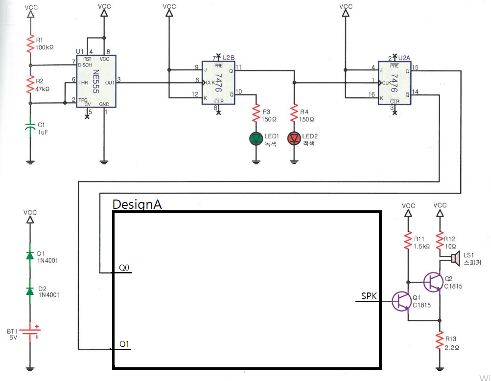

# 2음 경보기 — 문제

직 종 명

공업전자기기

과 제 명

PCB1(회로설계)

과제번호

제 1 과제

경기시간

비 번 호

감독위원확인

[문제1] 진리표를 참고하여 2음 경보기를 하는 회로를 재료목록을 참고하여 설계하시오.

품명

개수

품명

개수

7400

2/4개

저항 120K / 21K

각 1개

4066

2/4개

저항 10K / 7K

각 1개

새라믹 콘덴서 0.1uF

1개

[재료목록]

SPK

Q0이 H

720Hz

Q1이 H

225Hz

[진리표]

