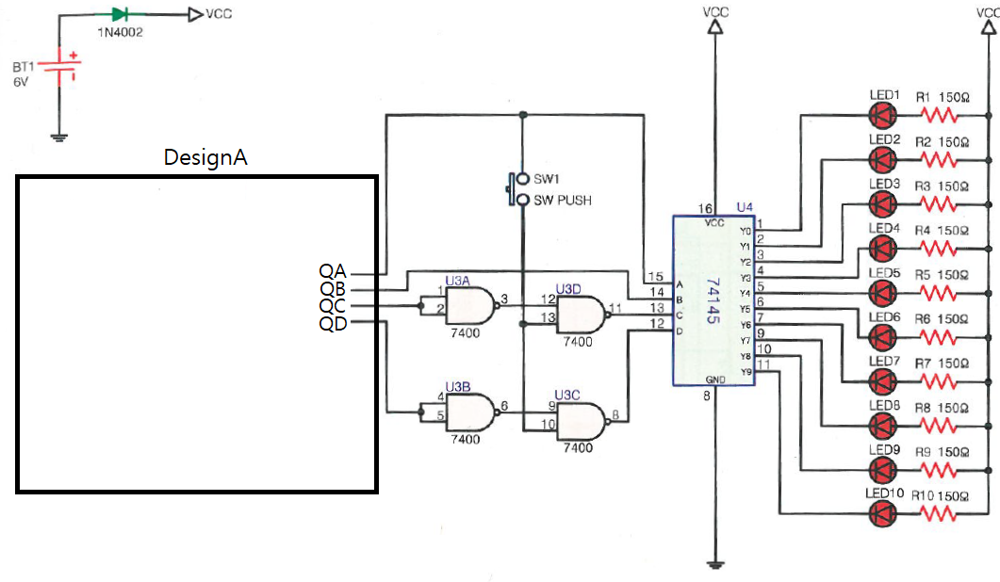

# 카운터 선택 표시 회로 — 문제

직 종 명

공업전자기기

과 제 명

PCB1(회로설계)

과제번호

제 1 과제

경기시간

비 번 호

감독위원확인

[문제1] 진리표를 참고하여 카운터 선택 표시 회로를 재료목록을 참고하여 설계하시오.

품명

개수

품명

개수

NE555

1개

74390

1/2개

저항

각 1개 22K / 20K

전해 콘덴서

10uF

세라믹 콘덴서

0.1uF

[재료목록]

NE555의 3번 = Pulse,

Pusle의 주파수(T) = 약 2.25 Hz

74390 출력

Pulse

QD

QC

QB

QA

0

0

0

0

0

1

0

0

0

1

2

0

0

1

0

3

0

0

1

1

4

0

1

0

0

5

0

1

0

1

6

0

1

1

0

7

0

1

1

1

8

1

0

0

0

9

1

0

0

1

[진리표]

