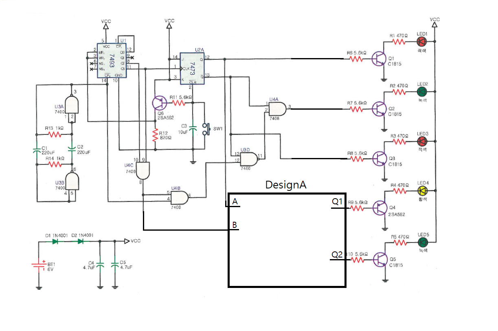

# 횡단보도 제어기 — 문제

직 종 명

공업전자기기

과 제 명

PCB1(회로설계)

과제번호

제 1 과제

경기시간

비 번 호

감독위원확인

[문제1] 진리표를 참고하여 횡단보도 제어기 회로를 재료목록을 참고하여 설계하시오.

품명

개수

품명

개수

7486

2/4개

7432

1/4개

다이오드 1N4148

2개

저항 10K

1개

[재료목록]

입력

출력

A

B

Q1

Q2

0

0

1

0

0

1

1

0

1

0

1

1

1

1

0

0

[진리표]

