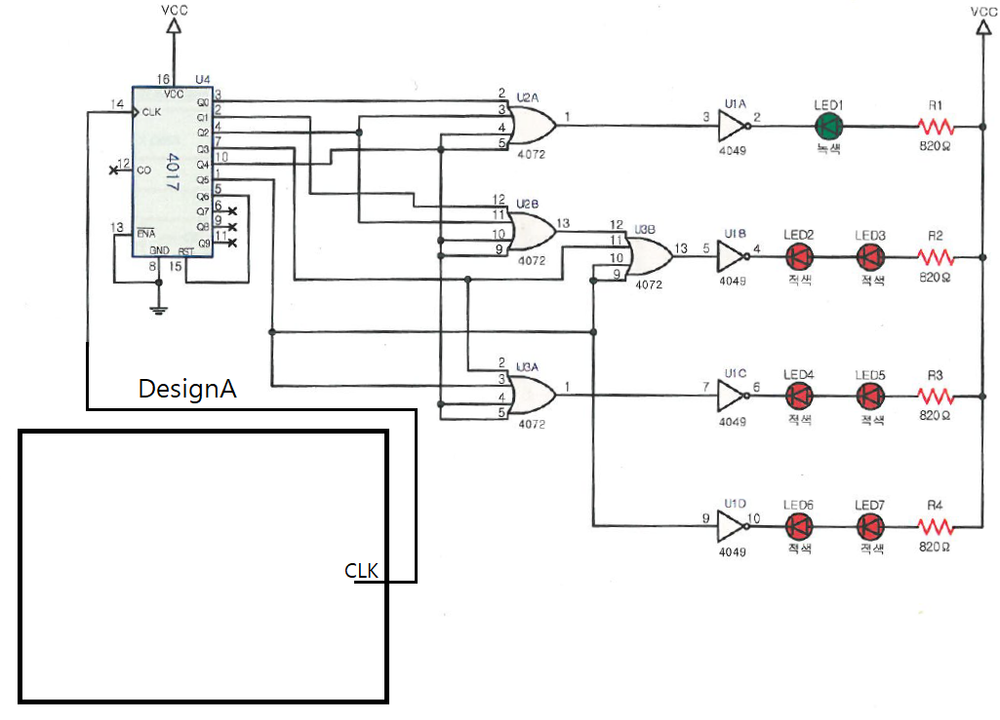

# 예약된 숫자 표시기 — 문제

직 종 명

공업전자기기

과 제 명

PCB1(회로설계)

과제번호

제 1 과제

경기시간

비 번 호

감독위원확인

[문제1] 진리표를 참고하여 예약된 숫자 표시기 회로를 재료목록을 참고하여 설계하시오.

품명

개수

품명

개수

NE555

1개

저항 16K

2개

저항 47K

1개

전해 콘덴서 1uF

1개

세라믹 콘덴서 0.1uF

1개

Push SW

1개

다이오드 1N4148

1개

[재료목록]

SW를 눌렀을시 듀티비가 50%인 구형파가 나오게 하시오.

입력

출력

SW

CLK

1

45.4Hz

0

X

[진리표]

