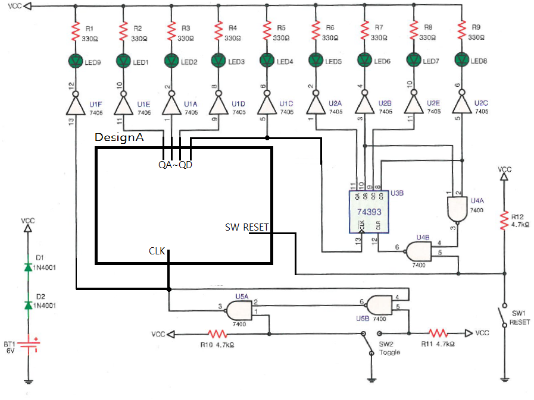

# 10진 계수기 — 문제

직 종 명

공업전자기기

과 제 명

PCB1(회로설계)

과제번호

제 1 과제

경기시간

비 번 호

감독위원확인

[문제1] 진리표를 참고하여 10진 계수기 회로를 재료목록을 참고하여 설계하시오.

품명

개수

품명

개수

7473

2개

7400

1/4개

[재료목록]

7473의 입력에 +5V(VCC)를 공급하지 않고 설계하시오.

입력

출력

Pulse

SW RESET

QA

QB

QC

QD

0

0

0

0

0

0

1

0

1

0

0

0

2

0

0

1

0

0

3

0

1

1

0

0

4

0

0

0

1

0

5

0

1

0

1

0

6

0

0

1

1

0

7

0

1

1

1

0

8

0

0

0

0

1

9

0

1

0

0

1

8

1

0

0

0

0

7

1

0

0

0

0

[진리표]

