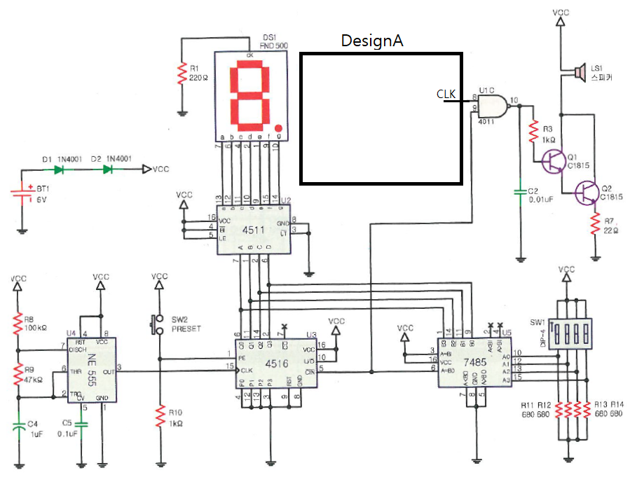

# 10진 설정 경보기 — 문제

직 종 명

공업전자기기

과 제 명

PCB1(회로설계)

과제번호

제 1 과제

경기시간

비 번 호

감독위원확인

[문제1] 진리표를 참고하여 10진 설정 경보기 회로를 재료목록을 참고하여 설계하시오.

품명

개수

품명

개수

LF356

1개

7905

1개

저항

각 1개 20K / 10K

저항

7.5K

세라믹 콘덴서

3개 0.1uF

[재료목록]

정전압 IC 7905로 –5V를 설계하시오.

(단, 7905의 입력과 출력측에 평활회로를 이용하여 잡음대책을 강구하시오.)

LF356_3의 출력 (CLK)

967Hz

[진리표]

